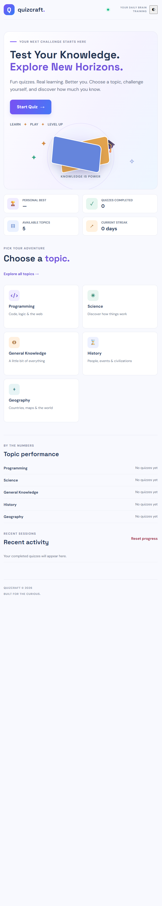

# QuizCraft

QuizCraft is a responsive, browser-based quiz app for short practice sessions across programming, science, general knowledge, history, and geography.

**Live demo:** Pending GitHub Pages setup.

## Features

- Choose a subject or mix questions from all topics, then set difficulty, length, and timer.
- Deadline-based 30-second and 60-second timers, with pause and skip controls.
- Shuffled answer options, keyboard shortcuts, answer explanations, and mistake review.
- Retry a complete quiz or only the questions missed.
- Local progress history, topic best and average scores, and a daily streak.
- Dark mode, score sharing, and a progress reset control.
- Optional Open Trivia DB questions when online; the bundled question bank remains available offline.

## Tech

Vanilla JavaScript ES modules, HTML, CSS, localStorage, Open Trivia DB, and Vitest.

## Run locally

ES modules require an HTTP server; opening `index.html` directly as a `file://` URL is not supported.

1. Install Node.js and npm.
2. Run `npm install` and `npm test` to install dependencies and run the quiz unit tests.
3. Open the project in VS Code and use the Live Server extension, or run `python -m http.server 8000` and visit `http://localhost:8000`.

The GitHub Actions workflow in `.github/workflows/pages.yml` deploys the repository root to GitHub Pages on pushes to `main`. Enable **Settings → Pages → Build and deployment → GitHub Actions** in the repository, then update the live demo URL above and the repository description after deployment.

## Credits

Online trivia questions are provided by [Open Trivia DB](https://opentdb.com/). The bundled questions work without a network connection.